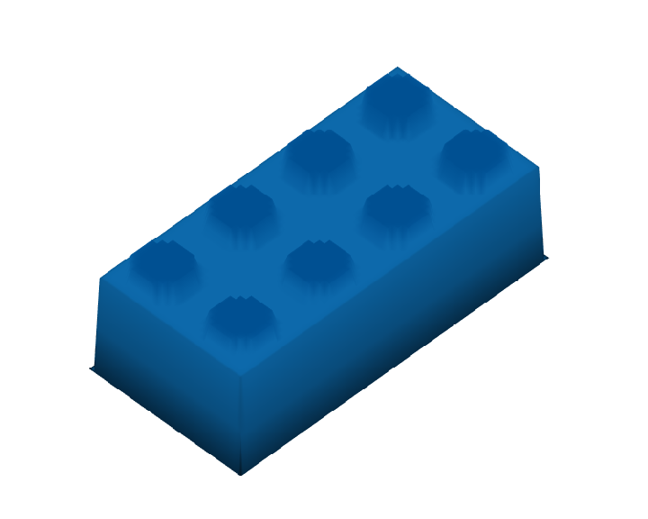
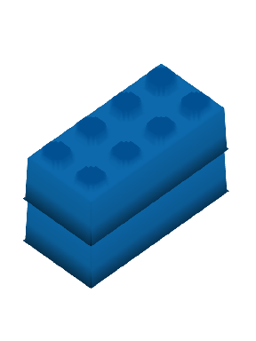
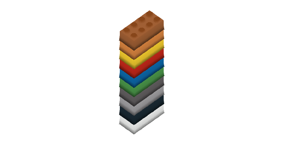

LEGO Mosaics in R
================

# brickr 

<!-- <!-- badges: start -->

[](https://www.tidyverse.org/lifecycle/#experimental)
<!-- <!-- badges: end -->

## Overview

**brickr** is a package for creating LEGO-esque 2D and 3D models using
the R [tidyverse](https://www.tidyverse.org/) and [Tyler
Morgan-Wall](https://twitter.com/tylermorganwall)’s
[rayshader](https://github.com/tylermorganwall/rayshader) package.

The package has two key uses:

  - Converting image files in to 2D and 3D LEGO mosaics
  - Building 3D LEGO models from simple data frames

## Installation

``` r
# To install the latest version from Github:
# install.packages("devtools")
devtools::install_github("ryantimpe/brickr")

#For 3D features, rayshader is also required.
install.packages("rayshader")
```

## 3D Models

Building 3D models requires a properly formatted data frames and two
functions.

**These functions are very experimental and will change. Better
documentation will be released soon.**

  - `bricks_from_table()` converts a matrix-shaped table of integers
    into LEGO bricks. For simple models, this table can be made manually
    using `data.frame()` or `tibble::tribble()`. For more advanced
    models, it’s recommended you use MS Excel or a .csv file. The
    left-most column in the table is associated with the Level or z-axis
    of the model. The function by default converts this to numeric for
    you. Each other column is an x-coordinate and each row is a
    y-coordinate. More flexible inputs will be available in a future
    release.

  - `display_bricks()` uses **rayshader** to display the 3D output from
    `bricks_from_table()`.

<!-- end list -->

``` r
library(brickr)

#This is a brick
brick <- data.frame(
  Level="A",
  X1 = rep(1,4),
  X2 = rep(1,4)
)

brick
```

    ##   Level X1 X2
    ## 1     A  1  1
    ## 2     A  1  1
    ## 3     A  1  1
    ## 4     A  1  1

``` r
brick %>% 
  bricks_from_table() %>% 
  display_bricks()

rayshader::render_snapshot()
```

<!-- -->

### Brick Colors

There are 2 ways to assign the color of the bricks. The
`display_colors()` function helps with ID numbers and names

  - Use the `brickrID` value instead of ‘1’ in the model input table.
    Values of ‘0’ are blank spaces.

  - Create a table of color assignments and pass this to
    `bricks_from_table()`

<!-- end list -->

``` r
brick_colors <- data.frame(
  .value = 1,
  Color = "Bright blue"
)

brick %>% 
  bricks_from_table(brick_colors) %>% 
  display_bricks()

rayshader::render_snapshot()
```

<!-- -->

### Stacking bricks

The Level column in the input table determines the height of the bricks.
`bricks_from_table()` will convert alphanumeric levels into a z
coordinate.

``` r
# A is the bottom Level, B is the top
brick <- data.frame(
  Level= c(rep("A",4), rep("B",4)),
  X1 = rep(1,4),
  X2 = rep(1,4)
)

brick %>% 
  bricks_from_table(brick_colors) %>% 
  display_bricks()

rayshader::render_snapshot()
```

<!-- -->

The same process works with many levels

``` r
#You can stack many bricks ----
brick <- data.frame(
  Level="A",
  X1 = rep(1,4),
  X2 = rep(1,4)
)

#... And they can all be different colors ----
1:10 %>% 
  purrr::map_df(~dplyr::mutate(brick, Level = LETTERS[.x], X1 = .x, X2 = .x)) %>% 
  bricks_from_table() %>% 
  display_bricks()

rayshader::render_snapshot()
```

<!-- -->

# Full Models

For larger models, use `tibble::tribble()` to more easily visualize the
model. For very large models, use MS Excel.

``` r
my_first_model <- tibble::tribble(
  ~Level, ~X1, ~X2, ~X3, ~x4, ~x5, ~X6, ~x7, ~x8,
  "A", 1, 1, 1, 0, 1, 1, 1, 1,
  "A", 1, 0, 0, 0, 0, 0, 0, 1,
  "A", 1, 0, 0, 0, 0, 0, 0, 1,
  "A", 1, 1, 1, 1, 1, 1, 1, 1,
  "B", 1, 0, 1, 0, 1, 1, 0, 1,
  "B", 1, 0, 0, 0, 0, 0, 0, 1,
  "B", 1, 0, 0, 0, 0, 0, 0, 1,
  "B", 1, 0, 1, 0, 0, 1, 0, 1,
  "C", 1, 1, 1, 1, 1, 1, 1, 1,
  "C", 1, 0, 0, 0, 0, 0, 0, 1,
  "C", 1, 0, 0, 0, 0, 0, 0, 1,
  "C", 1, 1, 1, 1, 1, 1, 1, 1,
  "D", 2, 2, 2, 2, 2, 2, 2, 2,
  "D", 1, 0, 0, 0, 0, 0, 0, 1,
  "D", 1, 0, 0, 0, 0, 0, 0, 1,
  "D", 2, 2, 2, 2, 2, 2, 2, 2,
  "E", 0, 0, 0, 0, 0, 0, 0, 0,
  "E", 2, 2, 2, 2, 2, 2, 2, 2,
  "E", 2, 2, 2, 2, 2, 2, 2, 2,
  "E", 0, 0, 0, 0, 0, 0, 0, 0
)

brick_colors <- tibble::tribble(
  ~`.value`, ~Color,
  1, "Bright blue",
  2, "Dark orange"
)
  
my_first_model %>% 
  bricks_from_table(brick_colors) %>% 
  display_bricks(theta = 210)

rayshader::render_snapshot()
```

<!-- -->

## Mosaics

The mosaic functions renders an imported JPG or PNG file using LEGO
colors and bricks. The resulting mosaic can be viewed in 2D and 3D. A
full explanation can be found on [this blog
post](http://www.ryantimpe.com/post/lego-mosaic1/), this [follow-up
post](http://www.ryantimpe.com/post/lego-mosaic2/),and this [third
post](http://www.ryantimpe.com/post/lego-mosaic3/).

``` r
mosaic1 <- jpeg::readJPEG("Images/goldengirls.jpg") %>% 
  image_to_bricks(img_size = 48) #Length of each side of mosaic in "bricks"

#Plot 2D mosaic
mosaic1 %>% display_set()
```

<!-- --> If you had previously
created mosaics before the package release, the script below will still
work.

``` r
mosaic1 <- jpeg::readJPEG("Images/goldengirls.jpg") %>% 
  scale_image(img_size = 48) %>% #Length of each side of mosaic in "bricks"
  legoize() %>%  
  collect_bricks()
```

### 2D Mosaics

`image_to_bricks()` can take a few important arguments:

  - `img_size` Providing a single value, such as `48`, crops the image
    to a square. Inputting a 2-element array, `c(56, 48)`, will output a
    rectangular image of `c(width, height)`.

  - `color_table` Data frame of possible brick colors in the mosaic.
    Defaults to the included data set `lego_colors`.

  - `brightness` adjusts the light of the image. Values greater than 1
    will lighten the image, while value less than 1 will darken it.

`display_set()` creates a ggplot of the image.

### 3D Mosaics

Two additional functions can convert the `image_to_bricks()` output into
a 3D mosaic using the
[rayshader](https://github.com/tylermorganwall/rayshader) package by
[Tyler Morgan-Wall](https://twitter.com/tylermorganwall).

  - `collect_3d()` translates the 2D LEGO mosaic into two matrices - one
    for the color image and one for the elevation of each point on the
    image. By default, the produced image has the height of 6 LEGO
    plates (2 LEGO bricks) with lighter colors having a higher
    elevation. Use `mosaic_height` to change the height of the mosaic
    and set `highest_el = 'dark'` to set the darker colors as the
    tallest bricks.

  - `display_3d()` simply calls `rayshader::plot_3d()`, but pulls both
    the hillshade and elevation matrices from the output of
    `collect_3d()` and fixes some of the arguments. See
    `?rayshader::plot_3d()` for more information.

<!-- end list -->

``` r
library(rayshader)

mosaic1 %>% 
  collect_3d() %>% 
  display_3d(fov=0,theta=-20,phi=30,windowsize=c(1000,800),zoom=0.7)

render_snapshot()
```

<!-- -->

## LEGO Mosaics IRL

Additional functions assist in the translation from the LEGO mosaic
image into a real LEGO set.

### Instructions

Use `generate_instructions()` to break the LEGO mosaic image into
easier-to-read steps for building the set. This defaults to 6 steps, but
passing any integer value will generate that many steps.

``` r
mosaic1 %>% generate_instructions(9)
```

<!-- -->

### Piece list and count

Use `display_pieces()` to generate a graphic and count of all required
plates or bricks (for stacked mosaics). These are sorted by color and
size for easy purchase on LEGO.com’s
[Pick-a-Brick](https://shop.lego.com/en-US/Pick-a-Brick) section using
the advanced search option. Alternatively, use `table_pieces()` to
produce a data frame table of all required bricks.

``` r
mosaic1 %>% display_pieces()
```

<!-- -->
