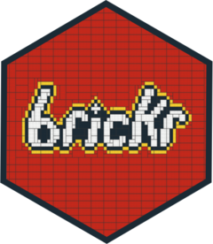
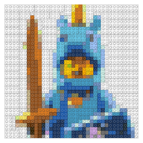
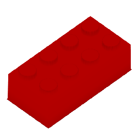
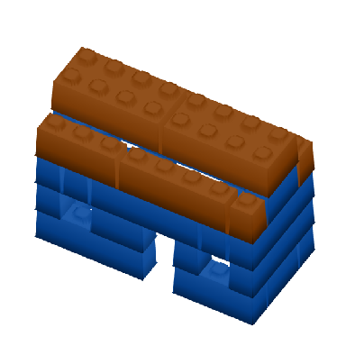
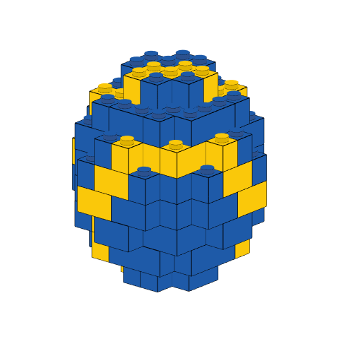
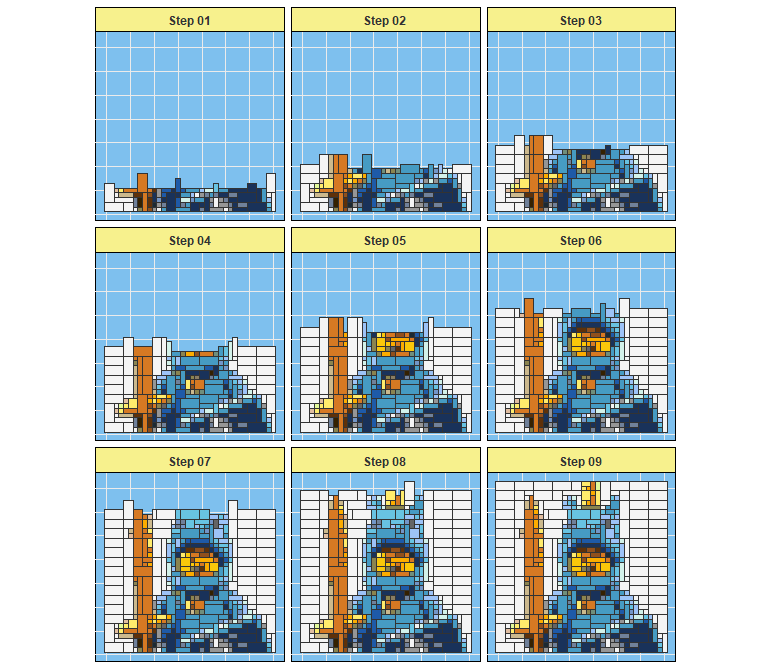
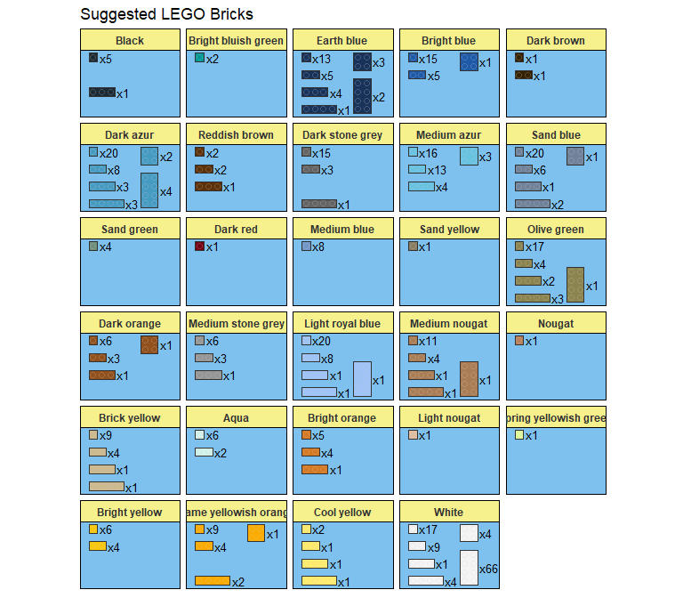

The LEGO® System in R
================

# brickr 

<!--   <!-- badges: start -->

[](https://www.tidyverse.org/lifecycle/#experimental)
[](https://travis-ci.org/ryantimpe/brickr)
<!--   <!-- badges: end -->

## Overview

**brickr** is a package for bringing the LEGO® experience into the R and
[tidyverse](https://www.tidyverse.org/) ecosystem.

The package is divided into 2 systems:

  - [**Mosaics**](#mosaics): Convert image files into mosaics that could
    be built using LEGO® bricks.
  - [**3D Models**](#3d-models): Build 3D LEGO® models from data tables
    using [rgl](https://cran.r-project.org/web/packages/rgl/index.html).

brickr also includes tools help users create the Mosaics and 3D model
output using real LEGO® elements.

Check out [brickr.org](http://brickr.org) for more detail\!

### What’s the point?

The goal of **brickr** is to provide a series of tools to integrate the
LEGO® system with R by:

  - Enhancing a real world building experience with mosaics, generated
    instructions, and piece counts.
  - Generating interest in R and coding for new audiences with
    easy-to-create 3D models.
  - Embracing pure novelty.

*brickr is developed under the [Fair
Play](https://www.lego.com/en-us/legal/notices-and-policies/fair-play/)
policy using publicly available information about LEGO® products. brickr
is not affiliated with The LEGO Group.*

## Installation

``` r
# To install the latest version from Github:
# install.packages("remotes")
remotes::install_github("ryantimpe/brickr")
```

## Mosaics

The mosaic functions renders an imported JPG or PNG file using LEGO
colors and bricks.

``` r
demo_img = tempfile() 
download.file("http://ryantimpe.com/files/mf_unicorn.PNG", demo_img, mode="wb")

mosaic1 <- png::readPNG(demo_img) %>% 
  image_to_mosaic(img_size = 36) #Length of each side of mosaic in "bricks"

#Plot 2D mosaic
mosaic1 %>% build_mosaic()
```

<!-- -->

In general, any **brickr** function that begins with `build_` generates
a graphical output from a **brickr** list object, generated from other
functions.

### Customization

`image_to_mosaic()` can take a few important arguments. See
`?image_to_mosaic()` for full detail.

  - `img_size` Providing a single value, such as `48`, crops the image
    to a square. Inputting a 2-element array, `c(56, 48)`, will output a
    rectangular image of `c(width, height)`.

  - `color_table` & `color_palette` Options to limit the color of bricks
    used in mosaics, as not all colors produced by LEGO are readily
    available. Set `color_palette` to ‘universal’ or `c('universal',
    'generic')` to limit colors to the most common ones. Use a subset of
    the data frame `lego_colors` as the `color_table` to specify a
    custom palette.

  - `method` Technique used to map image colors into the allowed brick
    colors. Defaults to ‘cie94\`, but other options include ’cie2000’
    and ‘euclidean’. Also includes the option ‘brickr\_classic’, used in
    previous version of the package.

## 3D Models

The `bricks_from_*` series of functions creates 3D models of LEGO bricks
from a variety of input formats.

  - `bricks_from_table()` & `bricks_from_excel()` convert a
    matrix-shaped table of integers into LEGO bricks. For simple models,
    this table can be made manually using `data.frame()` or
    `tibble::tribble()`. For more advanced models, it’s recommended you
    use MS Excel or a .csv file. The left-most column in the table is
    associated with the Level or z-axis of the model.
    `bricks_from_excel()` is a wrapper function to more easily build
    models designed using a Microsoft Excel template. Please see this
    repo: [brickr toybox](https://github.com/ryantimpe/brickr_toybox).

  - `bricks_from_coords()` takes a data frame with `x`, `y`, & `z`
    integer values, and `Color` columns, where each combination of x, y,
    & z is a point in 3-dimensional space. Color must be an official
    LEGO color name from `build_colors()`. This format is much more
    flexible than `bricks_from_table()` and allows the programmatic
    development of 3D models. For other options, see the “Piece type in
    3D Models” vignette.

  - `bricks_from_mosaic()` converts a 2D [mosaic](#mosaics) object from
    an image into 3D LEGO models, respectively.

Pass the output from any `bricks_from_*()` function to `build_bricks()`
to see the 3D model. Models are rendered in **rgl**.

``` r
library(brickr)

#This is a brick
brick <- data.frame(
  Level="A",
  X1 = rep(3,4), #The number 3 is the brickrID for 'bright red'
  X2 = rep(3,4)
)

brick %>% 
  bricks_from_table() %>% 
  build_bricks()

#Rotate the default view for a better snapshot
rgl::par3d(userMatrix = rgl::rotate3d(rgl::par3d("userMatrix"), 0.75*pi, 0, 0 ,1))
```

<!-- -->

### Stacking bricks

The Level column in the input table determines the elevation of the
bricks. `bricks_from_table()` will convert alphanumeric levels into a z
coordinate.

For larger models, use `tibble::tribble()` to more easily visualize the
model. For very large models, use a csv or Excel.

``` r
my_first_model <- tibble::tribble(
  ~Level, ~X1, ~X2, ~X3, ~x4, ~x5, ~X6, ~x7, ~x8,
  "A", 1, 1, 1, 0, 1, 1, 1, 1,
  "A", 1, 0, 0, 0, 0, 0, 0, 1,
  "A", 1, 0, 0, 0, 0, 0, 0, 1,
  "A", 1, 1, 1, 1, 1, 1, 1, 1,
  "B", 1, 0, 1, 0, 1, 1, 0, 1,
  "B", 1, 0, 0, 0, 0, 0, 0, 1,
  "B", 1, 0, 0, 0, 0, 0, 0, 1,
  "B", 1, 0, 1, 0, 0, 1, 0, 1,
  "C", 1, 1, 1, 1, 1, 1, 1, 1,
  "C", 1, 0, 0, 0, 0, 0, 0, 1,
  "C", 1, 0, 0, 0, 0, 0, 0, 1,
  "C", 1, 1, 1, 1, 1, 1, 1, 1,
  "D", 2, 2, 2, 2, 2, 2, 2, 2,
  "D", 1, 0, 0, 0, 0, 0, 0, 1,
  "D", 1, 0, 0, 0, 0, 0, 0, 1,
  "D", 2, 2, 2, 2, 2, 2, 2, 2,
  "E", 0, 0, 0, 0, 0, 0, 0, 0,
  "E", 2, 2, 2, 2, 2, 2, 2, 2,
  "E", 2, 2, 2, 2, 2, 2, 2, 2,
  "E", 0, 0, 0, 0, 0, 0, 0, 0
)

brick_colors <- tibble::tribble(
  ~`.value`, ~Color,
  1, "Bright blue",
  2, "Dark orange"
)
  
my_first_model %>% 
  bricks_from_table(brick_colors) %>% 
  build_bricks()

#Rotate the default view for a better snapshot
rgl::par3d(userMatrix = rgl::rotate3d(rgl::par3d("userMatrix"), 1.1*pi, 0, 0 ,1))
```

<!-- -->

### Programmatically build models

Use `bricks_from_coords()` to programmatically build 3D LEGO models
instead of manually drawing them in a spreadsheet or table. Here you
must provide whole number coordinates for x, y, and z, along with an
official LEGO color name for each point.

``` r
radius <- 4
sphere_coords <- expand.grid(
  x = 1:round((radius*2.5)),
  y = 1:round((radius*2.5)),
  z = 1:round((radius/(6/5)*2.5)) #A brick is 6/5 taller than it is wide/deep
) %>%
  mutate(
    #Distance of each coordinate from center
    dist = (((x-mean(x))^2 + (y-mean(y))^2 + (z-mean(z))^2)^(1/2)),
    Color = case_when(
      #Yellow stripes on the surface with a 2to4 thickness
      between(dist, (radius-1), radius) & (x+y+z) %% 6 %in% 0:1 ~ "Bright yellow",
      #Otherwise, sphere is blue
      dist <= radius ~ "Bright blue"
  ))

sphere_coords %>% 
  bricks_from_coords() %>% 
  build_bricks(outline_bricks = TRUE, rgl_lit = FALSE)


rgl::par3d(userMatrix = rgl::rotate3d(rgl::par3d("userMatrix"), 1.1*pi/4, 0, 0 ,1))
```

<!-- -->

The option `outline_bricks = TRUE` adds a black outline around the edges
of the bricks. Setting `rgl_lit = FALSE` turns off automated lighting
effects from rgl. Changing these two inputs together renders bricks in a
more cartoon fashion.

### Examples

More examples using `bricks_from_table()` and `bricks_from_coords()` can
be found at the links below.

  - [**Baby
    Yoda**](https://gist.github.com/ryantimpe/3893fdd0f94138d027bae35bf38b57c7)
    example using `bricks_from_excel()` with an animation.
  - [**brickr toybox**](https://github.com/ryantimpe/brickr_toybox) repo
    for tools and resources to get started.

## IRL

Additional functions assist in the translation of brickr objects into
actual LEGO bricks.

### Instructions

Use `build_instructions()` to break the mosaics and 3D models into
easier-to-read steps for building the set. This defaults to 6 steps, but
passing any integer value will generate that many steps.

``` r
mosaic1 %>% build_instructions(9)
```

<!-- -->

### Piece list and count

Use `build_pieces()` to generate a graphic and count of all required
plates or bricks (for stacked mosaics). These are sorted by color and
size for easy purchase on LEGO.com’s
[Pick-a-Brick](https://shop.lego.com/en-US/Pick-a-Brick) section using
the advanced search option. Alternatively, use `table_pieces()` to
produce a data frame table of all required bricks.

``` r
mosaic1 %>% build_pieces()
```

<!-- -->

## Acknowledgements

3D models in brickr would not exist without [Tyler
Morgan-Wall](https://twitter.com/tylermorganwall) and his
[rayshader](https://www.rayshader.com/) package. If you’re interested in
creating any time of 3D models in R, check out his
[rayrender](https://www.rayrender.net/) package.

All functions in brickr are created with the
[tidyverse](https://www.tidyverse.org/) and
[rgl](https://cran.r-project.org/web/packages/rgl/index.html).
